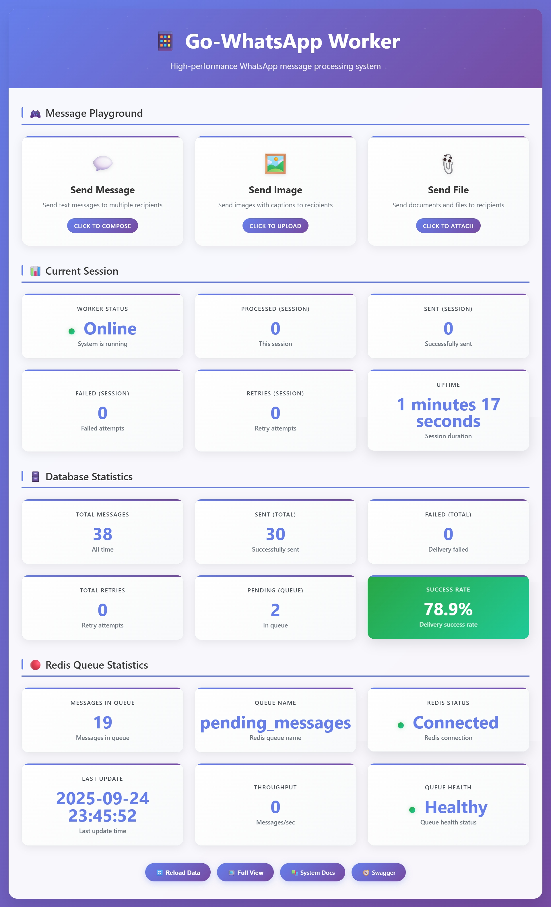
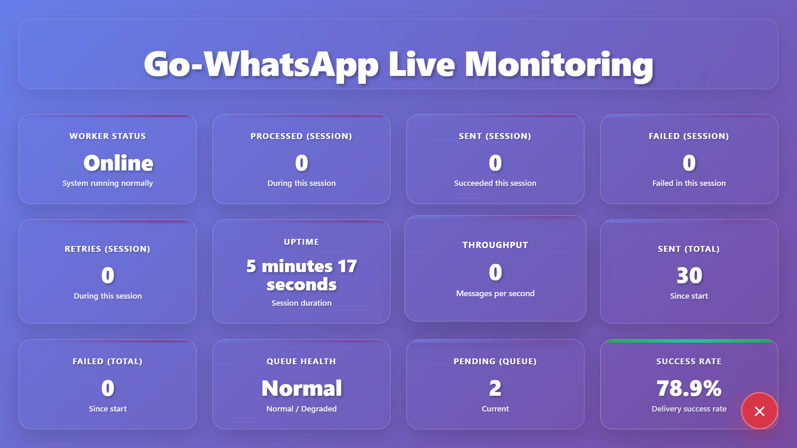
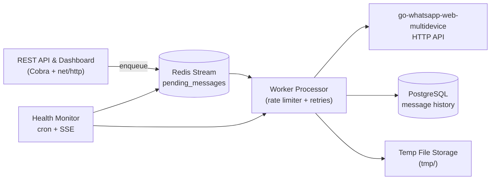
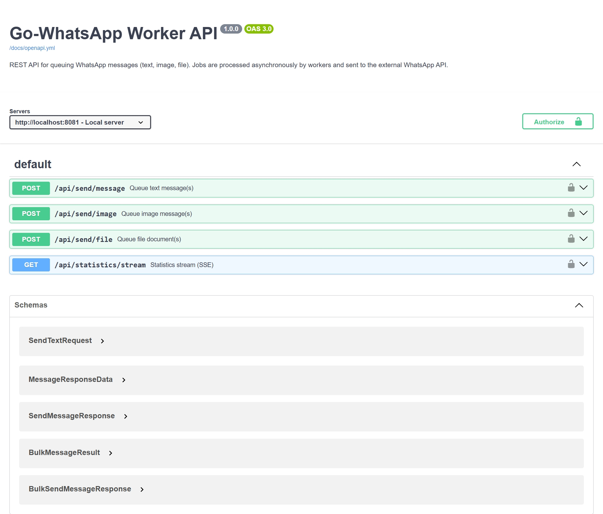

# Go-WhatsApp Worker ⚡

<p align="center">
  
</p>

[](https://go.dev/dl/)
[](https://goreportcard.com/report/github.com/your-org/gowhatsapp-worker)
[](https://www.docker.com/)
[](https://redis.io/docs/data-types/streams/)

> Production-grade WhatsApp queue worker for bulk and transactional messaging — built in Go, powered by Redis Streams, and orchestrated around Aldi Kemal’s [`go-whatsapp-web-multidevice`](https://github.com/aldinokemal/go-whatsapp-web-multidevice).

## Table of Contents

- [Overview](#overview)
- [Highlights](#highlights)
- [Feature Matrix](#feature-matrix)
- [Architecture](#architecture)
- [Message Lifecycle](#message-lifecycle)
- [Quick Start](#quick-start)
- [Configuration](#configuration)
- [API Surface](#api-surface)
- [Dashboard & Observability](#dashboard--observability)
- [Bulk Campaign Engine](#bulk-campaign-engine)
- [Queue, Rate Limiting & Health](#queue-rate-limiting--health)
- [File Handling Guarantees](#file-handling-guarantees)
- [Project Layout](#project-layout)
- [Development & Testing](#development--testing)
- [Troubleshooting](#troubleshooting)
- [Documentation & Resources](#documentation--resources)
- [License](#license)

## Overview

Go-WhatsApp Worker is the orchestration brain that sits behind your WhatsApp automation stack. It ingests API requests, splits and queues bulk campaigns, simulates human behaviour, persists history to PostgreSQL, and calls the official worker (`go-whatsapp-web-multidevice`) one message at a time. Everything ships with an immersive web dashboard, SSE-based live statistics, and a health monitor that keeps the system self-healing.

> ⚠️ This project does **not** send WhatsApp messages by itself. Bring your own running instance of [`go-whatsapp-web-multidevice`](https://github.com/aldinokemal/go-whatsapp-web-multidevice); we take care of everything before the final send call.

## Highlights

- Human-paced engine with typing simulation, rate profiles, natural breaks, and exponential backoff.
- Redis Streams consumer groups with delayed retries, idle message reclaiming, and horizontal fan-out.
- Chunked campaign coordinator that safely handles tens of thousands of recipients per request.
- Real-time operational dashboard with Message Playground, queue analytics, and SSE metrics.
- Direct PostgreSQL integration for message history, campaign progress, and audit trails.
- File lifecycle manager: streaming uploads to `tmp/`, UUID naming, secure cleanup, and hourly purges.
- Health monitor loop for stuck messages, Redis connectivity, and worker statistics.
- Docker-first deployment with a single command, yet equally friendly for local Go development.

## Feature Matrix

| Pillar | What you get |
| --- | --- |
| **API Gateway** | REST + SSE endpoints, Basic Auth, CORS, Swagger/OpenAPI served from `/docs` |
| **Message Types** | Text, image, file with view-once, compression, reply forwarding, disappearing timers |
| **Bulk Handling** | Automatic chunk splitting, resumable campaigns via tokens, chunk status tracking |
| **Queue Engine** | Redis Streams + scheduled ZSet retries, consumer groups, idle message reclaim |
| **Rate Limiting** | Manual & bulk profiles, typing delays, burst cooldowns, configurable jitter |
| **Observability** | Structured logrus logs, dashboard charts, queue stats, database metrics |
| **Reliability** | Exponential retries, stuck message watchdog, delayed requeue, health probes |
| **Security** | Auth middleware, strict file validation, temporary storage isolation |

## Architecture

<p align="center">
  
</p>



## Message Lifecycle

1. **Ingress** – An authenticated request hits `/api/send/...`. Uploads stream directly into `tmp/` using constant memory.
2. **Campaign planning** – Bulk requests are split into `BULK_CHUNK_SIZE` slices. Campaign + chunk records persist in PostgreSQL with UUID tokens.
3. **Queueing** – Each message becomes a JSON payload in Redis Streams (`XADD`) plus metadata in the database.
4. **Processing** – Worker goroutines use `XREADGROUP` to claim work, simulate typing, call the WhatsApp API, and mark results.
5. **Retry & delay** – Failures increment attempts, schedule exponential backoff (via sorted set), or mark the message as permanently failed.
6. **Cleanup** – Successful (or definitively failed) media triggers immediate file deletion along with hourly sweeps.
7. **Metrics** – Statistics stream to `/api/statistics/stream` and the dashboard updates live.

## Quick Start

### Prerequisites

- Go `1.24+`
- Redis `>= 5` with Streams support
- PostgreSQL `13+`
- Running instance of [`go-whatsapp-web-multidevice`](https://github.com/aldinokemal/go-whatsapp-web-multidevice)
- WhatsApp session authenticated within the sender project

### 1. Clone & configure

```powershell
git clone https://github.com/your-org/gowhatsapp-worker.git
cd gowhatsapp-worker
Copy-Item .env.example .env
# Edit .env with your Redis, PostgreSQL, and WhatsApp credentials
```

### 2. Option A – Docker Compose (recommended for first run)

```powershell
docker-compose pull
docker-compose up -d
```

- API & dashboard: `http://localhost:8081`
- Worker + health monitor run in the same container

### 3. Option B – Local Go environment

```powershell
go mod download
go run main.go start
```

The `start` command spins up the API, Redis consumer, delayed retry scheduler, and health monitor in a single process.

### 4. Dedicated worker mode (scale horizontally)

```powershell
go run main.go redis-worker
```

Use this mode to add more queue consumers while keeping a single API instance.

## Configuration

### Essential environment variables

| Variable | Required | Default | Purpose |
| --- | :---: | --- | --- |
| `DATABASE_HOST` | ✅ | – | PostgreSQL hostname for direct connection |
| `DATABASE_USER` / `DATABASE_PASSWORD` | ✅ | – | Database credentials |
| `WHATSAPP_BASE_URL` | ✅ | – | Base URL of `go-whatsapp-web-multidevice` |
| `WHATSAPP_AUTH` | ✅ | – | API token for the sender |
| `REDIS_HOST` | ✅ | `localhost` | Redis Streams host |
| `REDIS_QUEUE_NAME` | – | `pending_messages` | Stream key for enqueued messages |
| `DASHBOARD_USERNAME` / `DASHBOARD_PASSWORD` | ✅ (if auth enabled) | `admin` / `admin` | Basic Auth credentials |
| `RATE_PROFILE` | – | `manual` | Switch between manual and bulk pacing strategies |
| `BULK_CHUNK_SIZE` | – | `500` | Recipients per chunk when splitting bulk requests |

See `.env.example` or `internal/config/config.go` for the complete catalogue (Redis timeouts, natural breaks, SSE toggles, etc.).

### Rate profiles at a glance

| Profile | When to use | Behaviour |
| --- | --- | --- |
| `manual` | One-off or low volume | Uses `RATE_LIMIT_DELAY_MIN/MAX`, typing delays, natural breaks |
| `bulk` | Campaigns > 1k recipients | Respects `RATE_DELAY_MEAN_MS`, `RATE_DELAY_JITTER_MS`, burst cooldowns, configurable concurrency |

Changing the profile at runtime does not require restarting; the worker will adapt on the next loop.

## API Surface

All endpoints are protected by Basic Auth when `ENABLE_AUTH=true`.

| Method | Path | Description |
| --- | --- | --- |
| `GET` | `/` | Dashboard + Message Playground |
| `POST` | `/api/send/message` | Queue a text message (bulk supported via comma-separated or JSON array) |
| `POST` | `/api/send/image` | Queue an image (file upload or remote URL) |
| `POST` | `/api/send/file` | Queue any attachment |
| `GET` | `/api/statistics/stream` | Server-Sent Events stream with live KPIs |
| `GET` | `/docs` | Interactive documentation portal |
| `GET` | `/docs/openapi.yml` | Machine-readable OpenAPI spec |

Full request/response examples live in `docs/endpoint.md` and the dashboard’s Playground mirrors the same contracts.

## Dashboard & Observability

<p align="center">
  
</p>

- Message Playground for text, image, and file flows with bulk support.
- Live queue depth, throughput, retry and failure counters via SSE.
- Embedded API docs, configuration hints, and quick links to metrics.

## Bulk Campaign Engine

<p align="center">
  
</p>

- `BULK_CHUNK_SIZE` recipients per chunk to avoid oversized payloads.
- Campaign tokens allow pausing/resuming or resubmitting only failed chunks.
- Database records track per-chunk attempts, backoff timers, and error trails.
- Works equally for media/file campaigns; uploads are re-used per chunk.

## Queue, Rate Limiting & Health

- Redis Streams consumer group (`workers`) with individual `REDIS_CONSUMER_NAME` per instance.
- Idle (stuck) messages are reclaimed via `XCLAIM` if they exceed `STUCK_MESSAGE_TIMEOUT`.
- Exponential backoff up to 5 minutes per retry, capped by `WORKER_MAX_RETRIES`.
- Health monitor cron checks database, Redis, queue lag, and worker stats, logging warnings before failure.
- Natural typing presence toggles emulate human behaviour before each send request.

## File Handling Guarantees

- Every upload is streamed to `tmp/` with UUID filenames and extension whitelisting.
- Files are deleted on success, on terminal failure, and again by the hourly janitor.
- Detailed structured logs trace file lifecycle for auditing.
- Configurable storage root via `utils.NewFileStorage("tmp")` if you need shared volumes.

## Project Layout

```
gowhatsapp-worker/
├── cmd/                 # Cobra commands: start, redis-worker
├── internal/
│   ├── config/          # Viper-backed configuration loader & defaults
│   ├── database/        # PostgreSQL adapter & interface contracts
│   ├── redis/           # Redis Streams client & delayed queue helpers
│   ├── services/        # Message orchestration and campaign logic
│   ├── server/          # HTTP server, templates, auth middleware
│   ├── worker/          # Processor, rate limiter, health monitor
│   └── whatsapp/        # HTTP client for go-whatsapp-web-multidevice
├── docs/                # Endpoint cheatsheet, OpenAPI, architecture docs
├── public/              # Marketing & dashboard screenshots
└── tmp/                 # Runtime artifacts (ignored)
```

## Development & Testing

```powershell
# Run unit and integration tests
go test ./...

# Start the full stack (API + worker + health monitor)
go run main.go start

# Launch only the worker (for horizontal scaling)
go run main.go redis-worker --health-check=false
```

The repository ships with `.air.toml` for hot reloading if you prefer iterative development with [air](https://github.com/cosmtrek/air).

## Troubleshooting

- **Cannot connect to Redis** – verify version ≥ 5.0 and credentials; Streams require `XADD` support.
- **Messages stuck in processing** – check health logs; the reclaim loop runs every `STUCK_MESSAGE_TIMEOUT`.
- **Media not delivered** – ensure `go-whatsapp-web-multidevice` instance accepts file endpoints and file type.
- **High failure rate** – check dashboard statistics and consider increasing backoff.
- **Dashboard auth fails** – change credentials via `DASHBOARD_USERNAME`/`PASSWORD` and restart.

See `docs/system-documentation.html` for an in-depth operations guide.

## Documentation & Resources

- [`docs/endpoint.md`](./docs/endpoint.md) – endpoint-by-endpoint cheatsheet.
- [`docs/openapi.yml`](./docs/openapi.yml) – importable spec for Postman, Insomnia, or Swagger UI.
- [`docs/system-documentation.html`](./docs/system-documentation.html) – full architecture narrative with diagrams.
- [`docs/project-tree.md`](./docs/project-tree.md) – extended commentary on every package.

## License

This project is licensed under the MIT License - see the [LICENSE](LICENSE) file for details.

---

## Important Disclaimers

### ⚠️ No Affiliation with WhatsApp
This project is **NOT** affiliated with, endorsed by, or associated with WhatsApp Inc., Meta Platforms Inc., or any of their subsidiaries or related companies. WhatsApp is a trademark of Meta Platforms Inc.

### ⚠️ DYOR - Do Your Own Research
This software is provided "as is" without warranty of any kind. **Use at your own risk**. The authors and contributors are not responsible for any consequences arising from the use of this software.

### ⚠️ Legal Compliance
- **WhatsApp Business API**: This project integrates with third-party WhatsApp automation libraries. Ensure compliance with WhatsApp's Terms of Service and Business API policies.
- **Rate Limiting**: The system includes rate limiting to help comply with WhatsApp API limits, but you are responsible for proper usage.
- **Data Privacy**: Handle user data responsibly and in compliance with applicable privacy laws (GDPR, CCPA, etc.).

### ⚠️ Risk Warning
- **Account Suspension**: Misuse of WhatsApp automation may result in account suspension or termination.
- **Legal Risks**: Automated messaging may violate local laws and regulations.
- **Service Changes**: WhatsApp may change their API without notice, breaking functionality.

**By using this software, you acknowledge and accept these risks.**

---

Built with ❤️ by automation enthusiasts. Contributions are welcome—open an issue to coordinate before large changes.

---

*Last updated: September 26, 2025*
